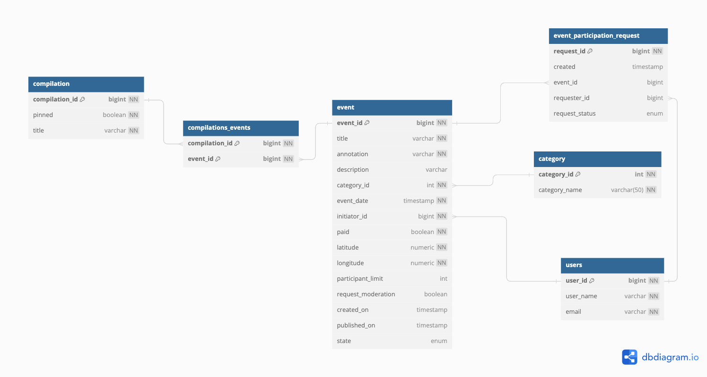
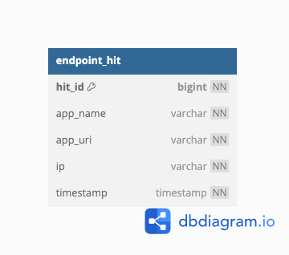

# java-explore-with-me
## summary
Дипломный проекты по обучению Java на платформе Яндекс Практикум.  

Основная идея проекта - создание бэкенда для сервиса-агрегатора мероприятий.   
Пользователи могут делиться информацией обинтересных событиях и находить компанию для участия а них.  
Сервис реализован в виде афиши - пользователи могут создавать события в определенных категориях и   
отправлять запросы на участие в событиях, созданных другими пользователями. События могут объединяться в подборки.  
Также предусмотрена роль админа-модератора.  

В качестве дополнительной фичи реализована возможность добавления лаков/дизлайков для событий   
и расчет рейтинга событий и пользователей-организаторов

Проект реализован как многомодульный:
- Микросервис статистики умеет определять популярность события исходя из его просмотров другими пользователями.
  - В рамках модуля реализованы две независимые библиотеки используемые при взаимодействии с микросервисом:
    - Клиент 
    - Dto
- Главный сервис с основной логикой проекта
У каждого микросервиса своя схема БД.

## stack
- Framework: SpringBoot
- Client: RestTemplate
- Database: PosgreSQL + JDBCTemplate
- Deploy: Docker-compose

### swagger:  
[Main service](./ewm-main-service-spec.json)  
[Statistic](./ewm-stats-service-spec.json)

### database schemas:
  
  